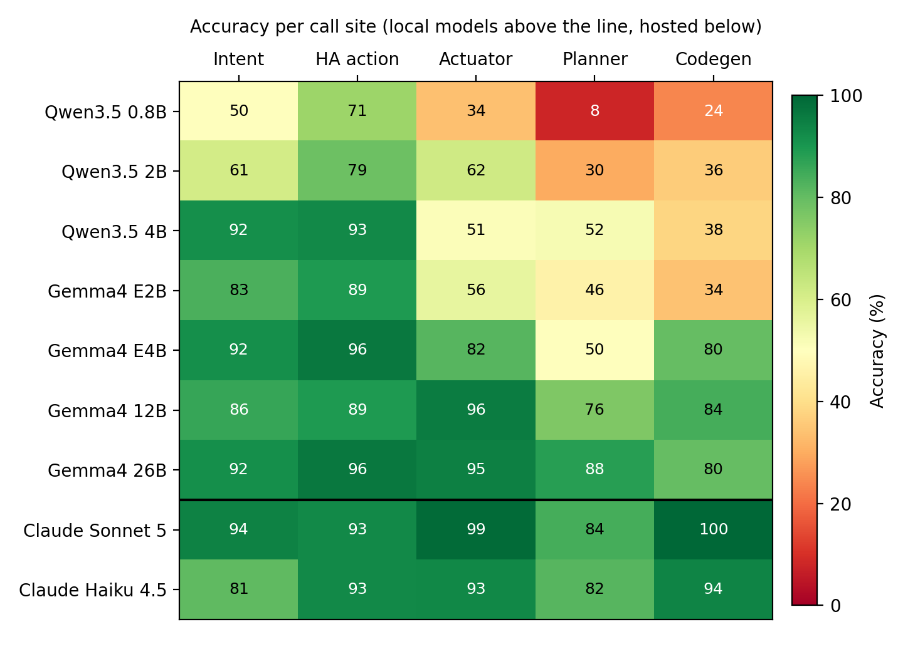
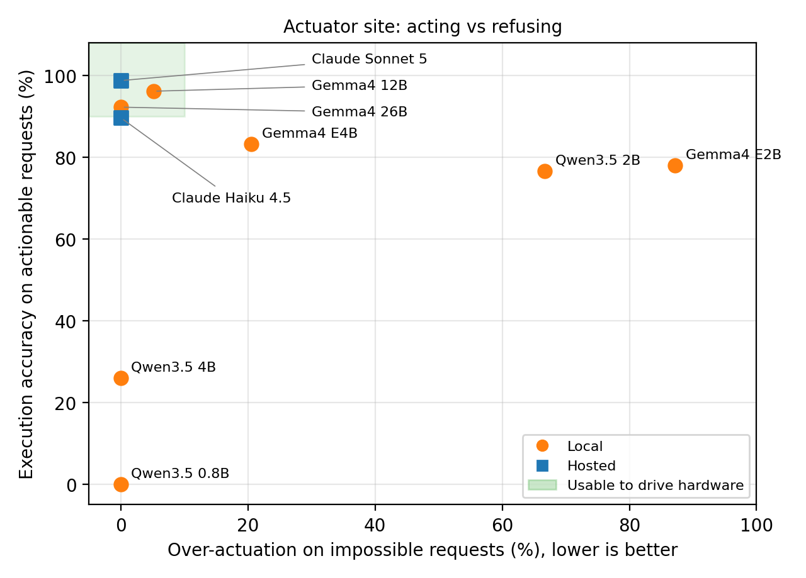

# slm-callsite-eval

Benchmark, evaluation harness and scored records for the paper

> **Not Every Call Needs a Frontier Model: Per-Call-Site Evaluation of Small
> Language Models in a Deployed Agentic Home-Automation System**
> Panagiotis Kasnesis, Christos Chatzigeorgiou, Lazaros Toumanidis,
> Amalia Contiero Syropoulou.
> 1st Workshop on SLMs for Agentic Systems (SLM-Agents), NeurIPS 2026, Paris.
> [OpenReview](https://openreview.net/forum?id=H5z1pZCS4E)

The system under evaluation is [Wactorz](https://github.com/waldiez/wactorz),
an open-source multi-agent home-automation framework. All experiments use the
production prompts of **Wactorz v0.5.3**, and the live end-to-end run used a
v0.5.3-based deployment. Later releases have changed these prompts, so pin
v0.5.3 when re-running (see `requirements.txt`).

## Results at a glance

Nine models, five call sites, 280 cases, one pass at temperature 0. All
numbers below are generated from `results/` by the scripts in `harness/`.

| Model | Intent | HA action | Actuator | Planner | Codegen | All | Cost ($) |
|---|---:|---:|---:|---:|---:|---:|---:|
| | *n=36* | *n=28* | *n=116* | *n=50* | *n=50* | *n=280* | |
| Qwen3.5 0.8B | 50.0 | 71.4 | 33.6 | 8.0 | 24.0 | **33.2** | 0 |
| Qwen3.5 2B | 61.1 | 78.6 | 62.1 | 30.0 | 36.0 | **53.2** | 0 |
| Qwen3.5 4B | 91.7 | 92.9 | 50.9 | 52.0 | 38.0 | **58.2** | 0 |
| Gemma4 E2B | 83.3 | 89.3 | 56.0 | 46.0 | 34.0 | **57.1** | 0 |
| Gemma4 E4B | 91.7 | 96.4 | 81.9 | 50.0 | 80.0 | **78.6** | 0 |
| Gemma4 12B | 86.1 | 89.3 | 95.7 | 76.0 | 84.0 | **88.2** | 0 |
| Gemma4 26B | 91.7 | 96.4 | 94.8 | 88.0 | 80.0 | **90.7** | 0 |
| Claude Sonnet 5 | 94.4 | 92.9 | 99.1 | 84.0 | 100.0 | **95.4** | 12.13 |
| Claude Haiku 4.5 | 80.6 | 92.9 | 93.1 | 82.0 | 94.0 | **89.6** | 3.06 |

Rankings change from site to site and are not monotonic in model size. With
paired testing, the best local model is statistically indistinguishable from
both hosted models on four of the five sites; only code generation separates
them.

**Routing policies.** Assigning a model per call site keeps most of the
all-hosted accuracy at a fraction of the cost:

| Routing configuration | Accuracy (%) | $ total | $/call | Saving (%) |
|---|---:|---:|---:|---:|
| All hosted | 95.4 | 12.13 | 0.0433 | 0 |
| Hosted for generation only | 93.9 | 2.15 | 0.0077 | 82 |
| All local, best per site | 91.8 | 0.00 | 0.0000 | 100 |
| All local, single model (Gemma4 26B) | 90.7 | 0.00 | 0.0000 | 100 |

Accuracy here is weighted by benchmark case counts, not by a deployment's call
mix. The paper also validates these policies end to end on the live system.

**Actuation safety.** Aggregate accuracy hides two opposite failure modes on
the actuator site: some small models act on devices that do not exist, others
refuse almost everything. Only models in the top-left corner are usable to
drive hardware.

| Model | Exec. acc. | Over-act. | Silent | Joint |
|---|---:|---:|---:|---:|
| Qwen3.5 0.8B | 0.0 | 0.0 | 100.0 | **0.0** |
| Qwen3.5 2B | 76.6 | 66.7 | 0.0 | **46.5** |
| Qwen3.5 4B | 26.0 | 0.0 | 72.7 | **41.2** |
| Gemma4 E2B | 77.9 | 87.2 | 0.0 | **22.0** |
| Gemma4 E4B | 83.1 | 20.5 | 2.6 | **81.3** |
| Gemma4 12B | 96.1 | 5.1 | 0.0 | **95.5** |
| Gemma4 26B | 92.2 | 0.0 | 2.6 | **95.9** |
| Claude Sonnet 5 | 98.7 | 0.0 | 0.0 | **99.3** |
| Claude Haiku 4.5 | 89.6 | 0.0 | 6.5 | **94.5** |

*Exec. acc.*: correct actions on the 77 actionable requests. *Over-act.*: share
of the 39 impossible requests that produced at least one service call.
*Silent*: share of actionable requests answered with an empty action list.
*Joint*: harmonic mean of execution accuracy and correct refusal.

## Layout

    benchmark/   280 cases across five call sites
                   intent_ha_hard.jsonl     36 intent + 28 HA action
                   actuator.jsonl,          116 actuator cases, two installations
                   actuator_curated.jsonl,    (site B and cross-site cases ship
                   actuator_b_keys.jsonl,      as keys only; see Privacy)
                   crosssite_keys.jsonl
                   planner_grounded.jsonl   50 planner
                   dynamic_strict.jsonl     50 codegen
    harness/     evalharness.py            runs a model over a case file
                 make_bench_*.py           generators the cases came from
                 analyze_results.py        scoring
                 make_paper_tables.py      every table in the paper
                 make_figures.py           the README figures (needs matplotlib)
    results/     final_scored.jsonl        2520 records: 9 models x 280 cases,
                                           one pass, temperature 0
                 e2e_user_eval.jsonl       46 live cases x 3 routing configs,
                                           judged by a person
    figures/     per_site_accuracy.png, actuation_safety.png

## Reproducing the paper's tables

Every number in the paper is generated, none typed by hand. This needs only
Python 3.10+ and no third-party packages:

    python3 harness/make_paper_tables.py results/final_scored.jsonl \
      --e2e results/e2e_user_eval.jsonl --bench benchmark --out tables

This writes the `.tex` tables and `numbers.tex` (the inline macros) to
`tables/`. To regenerate the figures (needs `pip install matplotlib`):

    python3 harness/make_figures.py results/final_scored.jsonl --out figures

## Re-running models

Re-running needs the framework, because the harness imports the production
prompts and the LLM provider factory from it:

    python3 -m venv .venv && . .venv/bin/activate
    pip install -r requirements.txt
    python harness/evalharness.py --models "ollama:qwen3:4b" \
      --prompts benchmark/intent_ha_hard.jsonl --temperature 0 --out results/

See `python harness/evalharness.py --help` for all options. Provider
credentials and endpoints are configured as in Wactorz v0.5.3.

## Record schema

One JSON object per line: `model`, `case_id`, `category`, `rep`, `passed`,
`output`, `input_tokens`, `output_tokens`, `latency_s`, `cost_usd`, `error`.
`category` is the call site, and `case_id` encodes the sub-group used in the
appendix breakdowns.

## Answer keys

Three `intent` keys and the planner entity block were revised after inspecting
model outputs, for the reasons given in the paper's Limitations section. Both
key sets are included so the revision can be checked. The revisions moved the
hosted model +0.08 and three local models -0.03, against the direction of the
paper's conclusion.

## Prompts

The five prompts are reproduced verbatim in Appendix A of the paper. The first
three are imported unchanged from Wactorz v0.5.3. The planner and codegen
prompts are condensed variants that keep the output contract scoring depends on.

## Privacy

The benchmark is grounded in two installations in an occupied home, so some
material is withheld or redacted:

- Device registries are not shipped. They carry network and location
  identifiers.
- `actuator_b_keys.jsonl` (14 cases, site B) and `crosssite_keys.jsonl`
  (32 cases) ship as keys only: case id and answer key, with the prompt
  removed, because their device payloads describe a resident's phone and the
  building's network. Every scoring table reproduces from the keys alone,
  since scoring compares the emitted action set against the key and never reads
  the prompt. What the keys do not permit is re-running a model on those 46
  prompts. The other 70 actuator cases and every intent, HA-action, planner
  and codegen case ship in full.
- Private addresses in recorded prompts and outputs are replaced with the
  RFC 5737 documentation range. Recorded `input_tokens` describe the original
  text, so re-tokenising a redacted prompt may differ by a token or two.

## License

Apache-2.0, matching Wactorz.

## Acknowledgments

Research supported by the NVIDIA Academic Grant Program using two NVIDIA DGX
Spark systems.
